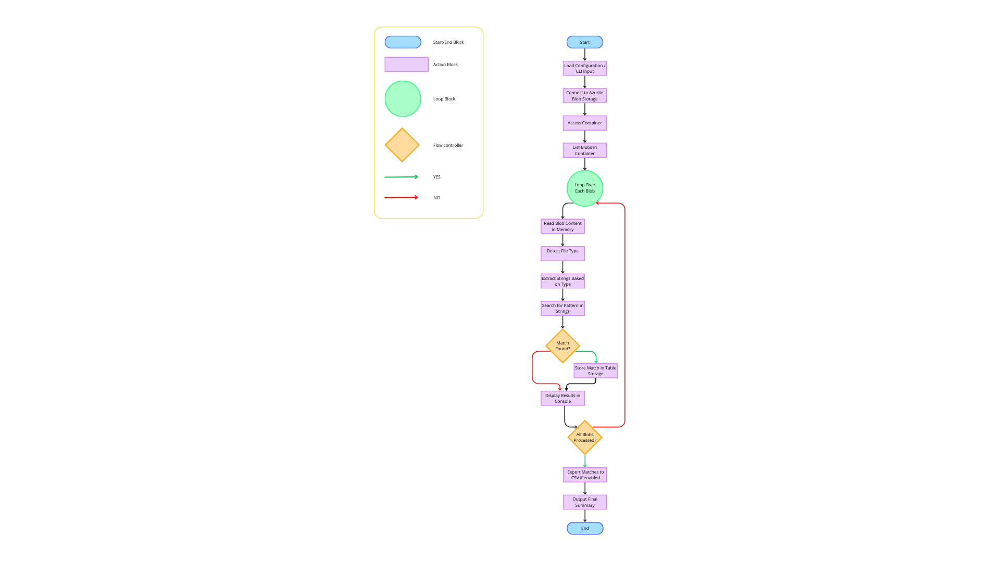
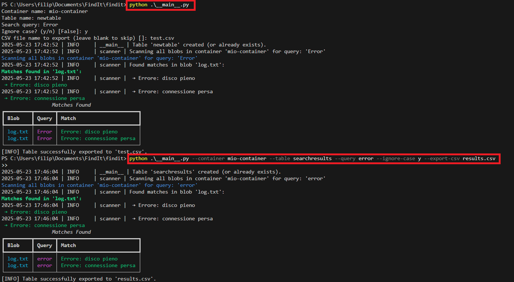

# FindIt - Documentation 🔍 
 
## Intro 🧩 
FindIt is a command-line application that allows you to search for a string within the blobs contained in an Azure Blob Storage container (emulated with Azurite).
The results found are saved to Azure Table Storage and can be exported in CSV format.

## Problem vs Solution 🚨
Searching for a specific string across a large number of files (e.g. logs, exports, reports) can be extremely time-consuming and error-prone, especially when files are stored in the cloud. Manual inspection of .txt, .json, or .csv files is inefficient and does not scale.

Whether you're debugging logs or scanning reports for key terms, FindIt speeds up the process and integrates smoothly with cloud infrastructure.

## Main Features 🔧
- Easily connect to an Azurite instance and manage blob containers and files: emulating Azure Blob Storage

- Scan all blobs in a specific container for a target text string

- Automatic file type recognition (.txt, .csv, .json)

- Save matches to Azure Table Storage with CSV export support

- Interactive CLI interface powered by click with input validation

- Display info, warnings, and errors with styled formatting and logging for traceability.

## Flowchart: Overview


## How to use it
- For an interactive prompt
```text
python __main__.py
```
- Run with arguments
```text
python search_blobs.py --container mio-container --table searchresults --query error --ignore-case y --export-csv results.csv
```
Where
```text
--container <example>         -> Name of the blob container to search
--table <example>             -> Table name to save results
--query <example>             -> String to search
--ignore-case <y> / <N>       -> Ignore case in search
--export-csv <example.csv>    -> Export the table results to a csv file with the specified name
```
- Example


## Project structure 📁
```text
findit/
│
├── __main__.py            # Entry point: launches the CLI application
├── config.py              # Configuration variables (e.g., connection strings)
├── scanner.py             # Logic to scan/search blobs in Azure Storage
├── logger_config.py       # Logger setup and configuration
├── exporter.py            # Function to export Azure Table to CSV
├── parser.py              # Utilities to parse file contents (CSV, JSON)
├── storage.py             # Azure Storage client helpers (blob, tables, containers)
├── upload_to_container.py # Module to insert blobs into the container
```

## Prerequisites 📦
```text
Software: Python 3.9+ - Visual Studio Code with Azurite extension
Libraries: azure-storage-blob, azure-data-tables, click, rich
```


